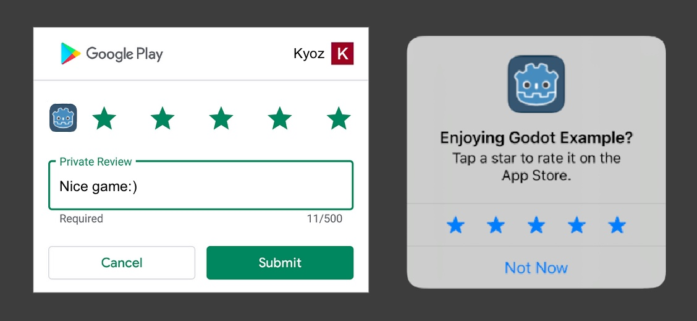

<h1 align="center">
  <br>
  
  <br>
  Godot Native Rating
  <br>
</h1>

<h4 align="center">Godot plugin to request Native Rating on Android/iOS. Supports Godot 3 & 4</a>.</h4>

<p align="center">
  <a href="https://github.com/kyoz/godot-native-rating/releases">
    
  </a>
  <span>&nbsp</span>
  <a href="https://github.com/kyoz/godot-native-rating/actions">
    
  </a>
  <span>&nbsp</span>
  <a href="https://github.com/kyoz/godot-native-rating/releases">
    
  </a>
  <span>&nbsp</span>
  
  <span>&nbsp</span>
  
</p>

<p align="center">
  <a href="#about">About</a> •
  <a href="#installation">Installation</a> •
  <a href="#usage">Usage</a> •
  <a href="#api">API</a> •
  <a href="#notes">Notes</a> •
  <a href="#contribute">Contribute</a> •
  <a href="https://github.com/kyoz/godot-native-rating/releases">Downloads</a> 
</p>

<p align="center">
  
</p>

# About

This plugin helps you request native rating on mobile (Android/iOS).

Built using automation scripts combined with CI/CD to help speed up the release progress as well as the release of hotfixes which save some of our time.

Supports Godot 3 & 4.

# Installation

## Android

Download the [Android plugin](https://github.com/kyoz/godot-native-rating/releases) (match your Godot version), and extract them to `your_project/android/plugins`

Enable `Rating` plugin in your Android export preset.

*Note*: You must [use custom build](https://docs.godotengine.org/en/stable/tutorials/export/android_custom_build.html) for Android to use plugins.

## iOS

Download the [iOS plugin](https://github.com/kyoz/godot-native-rating/releases) (match your Godot version), and extract them to `ios/plugins`

Enable `Rating` plugin in your iOS export preset.

# Usage

An `autoload` script is provided for easier use of this plugin.

Download [autoload file](./autoload) (match your Godot version). Add it to your project `autoload` list.

Then you can easily use the plugin anywhere with:

```gdscript
Rating.init()
Rating.show()

# Godot 3
Rating.connect("on_completed", self, "_on_completed")

# Godot 4
Rating.on_completed.connect(_on_completed)
```

"Why do I have to call `init()`?"  

Well, if you don't want to, you can change `init()` to `_ready()` on the `autoload` file. But in my experience, when using a lot of plugins, initializing all plugins on `_ready()` is not a good idea. This way, you can choose whenever to initialize the plugin e.g. when showing a loading scene, etc.

For more detail, see [examples](./example/)

# API

## Methods

```gdscript
void show() # Requests and shows rating Popup
```

## Signals

```gdscript
signal on_error(error_code) # Rating request failed, returning error_code
signal on_completed() # Rating request displayed and completed
```

## Error Codes

> `ERROR_GOOGLE_PLAY_UNAVAILABLE`

Android only. Happens when there's no Google Play Services on the user's phone. Rarely happens, because normally they will install your app through Google Play.

> `ERROR_NO_ACTIVE_SCENE`

iOS only. Happens when the plugin can't find an active scene. Make sure you calling `show()` method when the app is runing in foreground.

> `ERROR_UNKNOWN`

Rarely happens also. For example, on Android, if the user is in China Mainland, they are not allowed native rating. It could also happen if the user installed your app from sources other than Google Play.

# Notes

Testing on iOS is pretty simple.  

However, when testing on Android, you have to publish your app to Google Play Console, or at least make it public to [Internal Testing](https://play.google.com/console/about/internal-testing/) or else the rating Popup will not show.

When calling `show()`. If you get `on_completed` signal, it means the request has been completed. There is no further need to do anything except some storage caching to not show it again.

*WARNING*:

- Do NOT spam `show()`. You can call it after the user has completed some levels or after the user has come back to your game a few times. And most importantly, after showing, whenever you get `on_completed` or `on_error`, do NOT try to `show()` again, or else your app/game may get rejected when reviewed by Google/Apple.

- This plugin is sufficient for the rating process. Call `show()` and that's it. Do NOT show a Toast notification or a Dialog to tell the user to rate 5 star. Google/Apple will likely reject your game when reviewing.

# Contribute

I want to contribute to the Godot community so I create these plugins. I've prepared almost everything to help simplify and speed up the development and release progress.

With only one command, you can build and release this plugin. Read [DEVELOP.md](./DEVELOP.md) for more information.

If you find bugs, please open issues.

If you have time to fix bugs or improve the plugins, please open PR. It's always welcomed and appreciated.

# License

MIT © [Kyoz](mailto:banminkyoz@gmail.com)